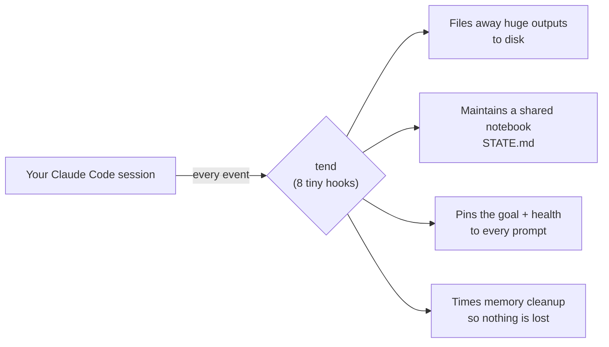
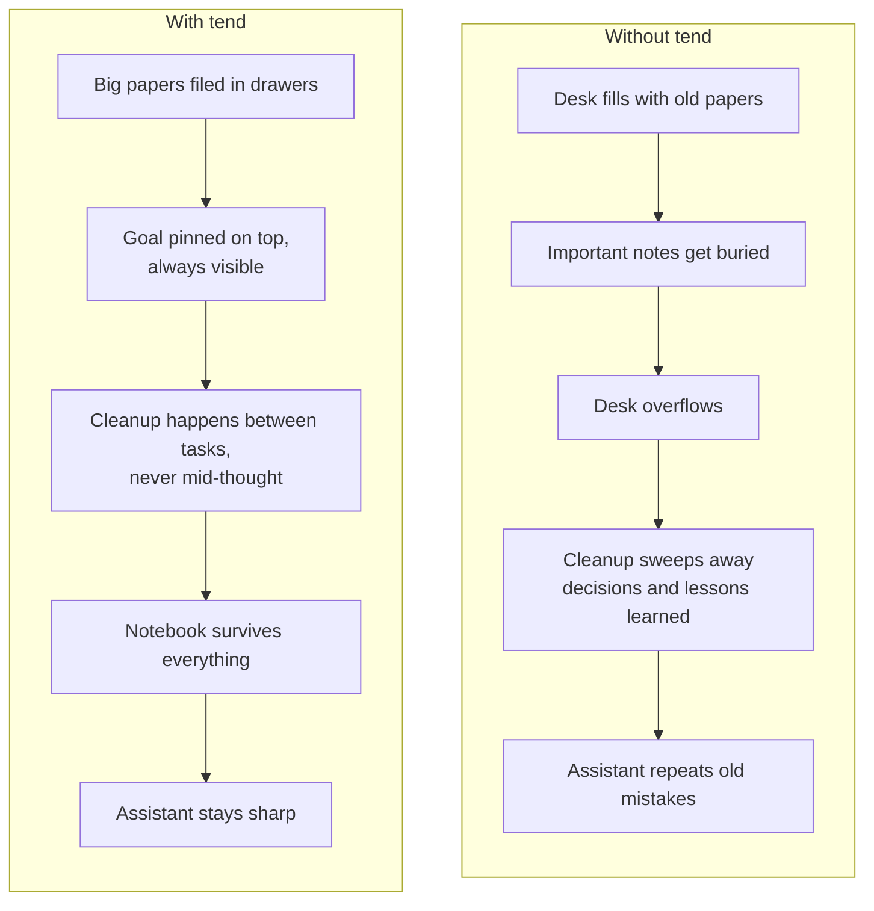
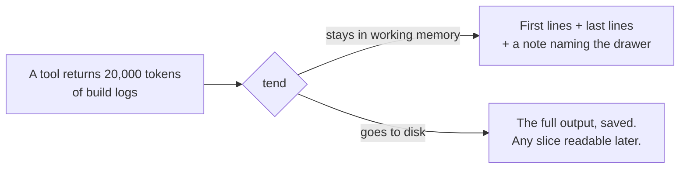
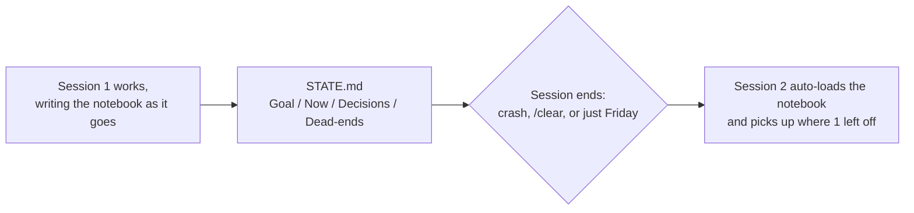
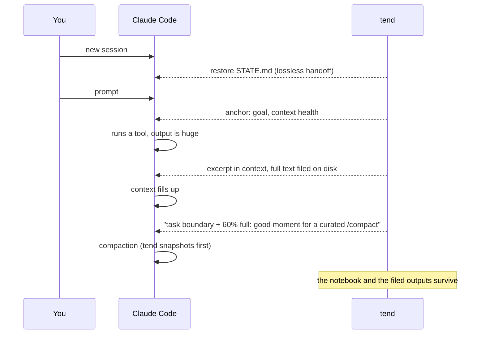
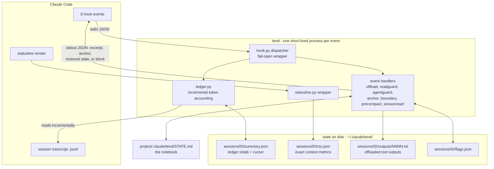
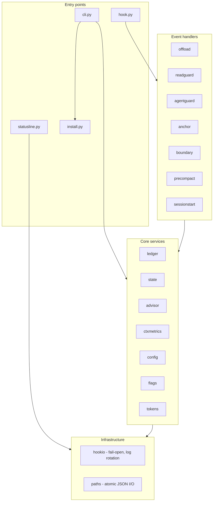
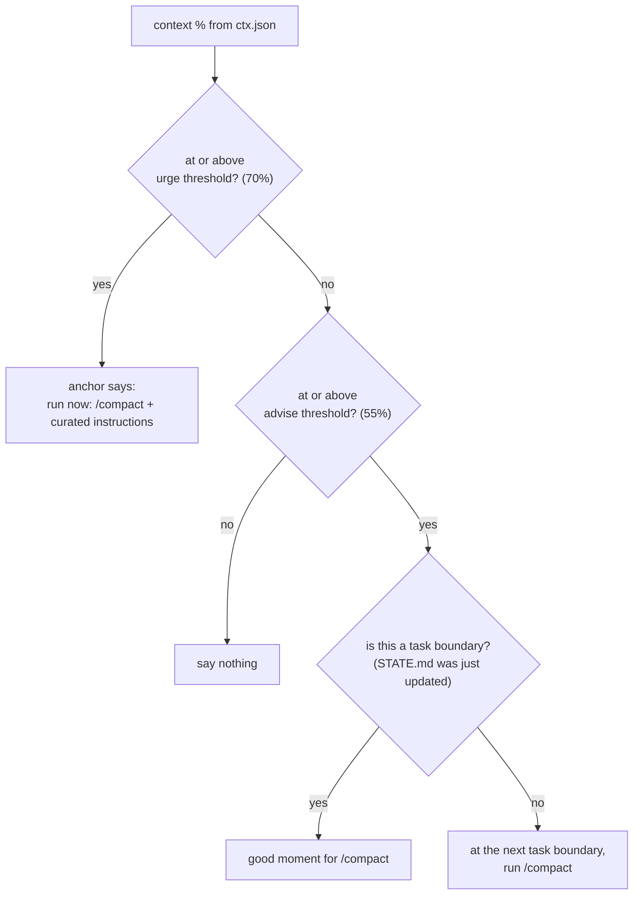
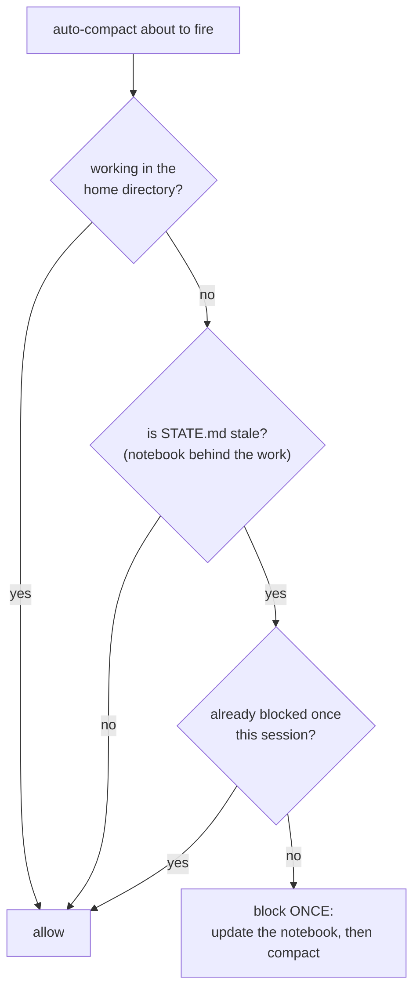

# tend

**Keep Claude Code sharp in long sessions.**

tend is a small, invisible helper that rides along with [Claude Code](https://claude.com/claude-code) and keeps its limited "working memory" clean — so the assistant stays smart ten hours into a big task instead of slowly losing the plot.



## The problem, in plain words

An AI assistant has a fixed amount of working memory, called the *context window*. Think of it as a desk. Every file it reads, every command output, every conversation turn is another sheet of paper on that desk.

On long tasks the desk fills up with old papers: a 5,000-line log it needed once, three versions of a file it already fixed, dead-end experiments. Two things go wrong:

1. **The assistant gets dumber.** The important stuff (what are we building? what did we decide?) is buried under junk.
2. **Eventually the desk overflows.** The assistant has to sweep papers into a box ("compaction") — and without supervision it sometimes sweeps away the notes that mattered.

tend is the colleague who quietly keeps the desk tidy.



## What tend does — four habits

| Habit | In plain words | In Claude Code terms |
|---|---|---|
| **File it, don't pile it** | A 10-page printout gets filed in a drawer; a sticky note on the desk says which drawer. | Oversized tool outputs are replaced with a head+tail excerpt; the full text is saved to disk with its path, retrievable with a bounded `Read`. |
| **Keep a notebook** | Goals, decisions, and dead-ends live in a notebook that survives even if the desk is cleared. | Each project gets `.claude/tend/STATE.md` (Goal / Now / Decisions / Dead-ends). New sessions auto-load it, so `/clear` is a lossless handoff. |
| **Sticky note with the goal** | A note on the monitor: *what we're doing, how full the desk is*. | A ≤400-token anchor is injected with every prompt: goal, current step, context %, stale-result warnings, and a `/compact` recommendation when it's time. |
| **Clean up at the right moment** | Tidy between tasks — never mid-thought, never throwing out the notebook. | tend detects task boundaries, recommends *curated* compaction (keep goal/decisions, drop raw outputs), snapshots before every compaction, and blocks one stale auto-compact until the notebook is updated. |

And one bonus habit, added after watching real usage bills:

| Habit | In plain words | In Claude Code terms |
|---|---|---|
| **Right-sized helpers** | When the assistant hires a helper, a note suggests: this errand doesn't need the most expensive expert. | When a subagent is spawned without an explicit model, tend suggests the cheapest model tier that fits the job (see [swarm](https://github.com/varmabudharaju/swarm) for the full tiering system). |

The first habit, in one picture:



And the notebook habit — why nothing important ever dies:



## See it

| `tend status` | `tend report` | `tend handoff` |
|---|---|---|
|  |  |  |

## How it fits into a session



## Install

```bash
python3 -m pip install --user -e .
tend install-hook        # merges hooks + statusline into ~/.claude/settings.json
# restart your Claude Code session
```

The installer is **non-destructive and reversible**: existing hooks and statusline are preserved and backed up (`settings.json.bak-tend`), and `tend uninstall-hook` puts everything back.

## Commands

| Command | Does |
|---|---|
| `tend status` | Context %, totals, stale-result tokens, STATE.md freshness |
| `tend report` | Full ledger: tool results by size, offloads, subagents |
| `tend handoff` | Show what the next session will auto-load |
| `tend on` / `tend off` | Global kill switch |
| `tend install-hook` / `tend uninstall-hook` | Reversible settings.json setup |

## Design principles

- **Fail-open, always.** A tend bug must never break your session. Every hook swallows its own errors (logged to `~/.claude/tend/tend.log`, rotated at 1 MB) and Claude Code continues as if tend weren't there.
- **Nudge, never block.** tend advises (read this file with a range; this spawn doesn't need the premium model; now is a good compact moment). The one narrow exception: it blocks a *stale auto-compact* exactly once, to protect the notebook.
- **Exact numbers, not guesses.** Context totals come from the session transcript's own token accounting; the context % comes from a statusline tee — tend measures, it doesn't estimate.
- **Daemon-less.** No background process. Eight tiny hook invocations that each read state from disk, act, and exit.

## Configuration

`~/.claude/tend/config.yaml`, overridable per project in `<project>/.claude/tend/config.yaml`. Keys and defaults are in `tend/config.py`. Invalid values fall back to defaults rather than disabling tend.

## Limitations

- **MCP tools with an `outputSchema`**: Claude Code validates replacement outputs against the tool's schema and silently keeps the original when a plain-text excerpt doesn't match. tend therefore skips offloading for `mcp__*` tools whose responses aren't plain strings. Built-in tools (Bash, Grep, Glob, WebFetch) are unaffected.
- `state_stale_tokens` counts **output tokens** generated since STATE.md was last marked (monotonic across compaction), not context-window growth. Default: 3000.

## Under the hood

### System design — how tend plugs into Claude Code

No daemon, no background process: Claude Code fires an event, a tiny tend process wakes, reads its state from disk, acts, and exits. Everything durable lives in plain files.



### Component view — module layers



### Flow chart — when does tend recommend compaction?

The advisor runs on every prompt; this is its whole decision:



And the one time tend ever blocks anything:



### Modules

```
tend/
  hook.py          entry point: python3 -m tend.hook (all 8 events)
  hookio.py        stdin/stdout plumbing, fail-open wrapper, log rotation
  ledger.py        incremental transcript ledger: exact context totals,
                   tool-result sizes, staleness, crash-safe single-file cursor
  offload.py       pillar 1: oversized-output offloading
  readguard.py     pillar 1b: nudge unbounded Reads of large text files
  agentguard.py    pillar 1c: model-tier nudge for subagent spawns
  state.py         STATE.md template, parsing, atomic seeding
  sessionstart.py  pillar 4: state restore into fresh sessions
  anchor.py        pillar 3: per-prompt anchor (urgency-first truncation)
  boundary.py      Stop-event task-boundary + staleness detection
  precompact.py    pillar 4 safety net: snapshot + one-shot stale block
  advisor.py       when and how to recommend a curated /compact
  statusline.py    statusline wrapper: tees exact context metrics to disk
  config.py        defaults < global yaml < project yaml, validated
  install.py       reversible settings.json merge (backup, mode-preserving)
  cli.py           status / report / handoff / on / off / (un)install-hook
```

164 tests (`python3 -m pytest`). Every bug fixed in v0.2 carries a regression test written from the bug's reproduction.

## Battle-tested by its sibling

tend v0.1 was adversarially reviewed by [swarm](https://github.com/varmabudharaju/swarm) — a 9-agent review (6 reviewers + 2 independent verifiers + synthesis) that reproduced every claim against the installed binary before reporting it. The verified report (33 confirmed findings, from a race that silently lost ledger records to a truncation bug that disabled the staleness net right after compaction) is in [`docs/swarm-review-2026-06-10.md`](docs/swarm-review-2026-06-10.md); v0.2 fixed all of them, test-first. The full design history lives in [`docs/superpowers/specs/`](docs/superpowers/specs/) and [`docs/superpowers/plans/`](docs/superpowers/plans/).
