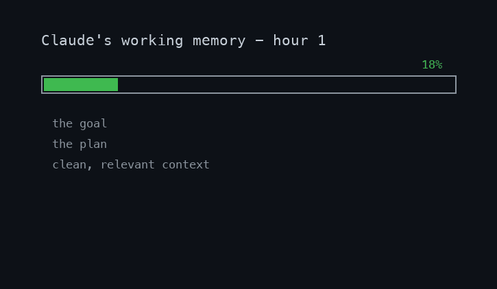
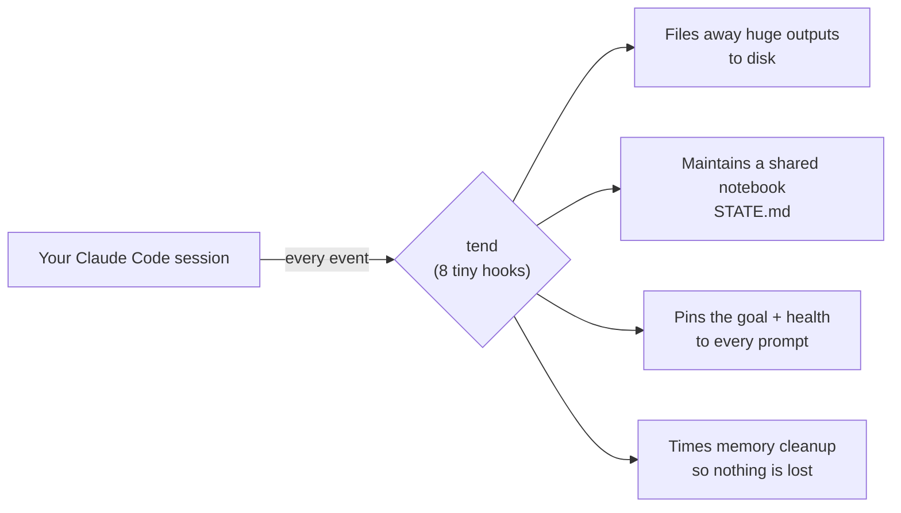
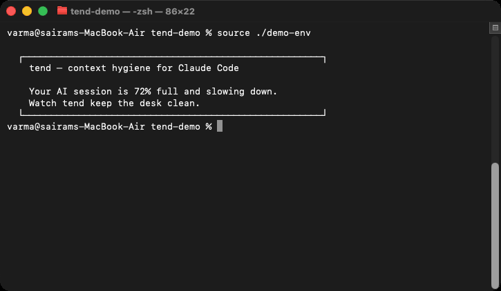
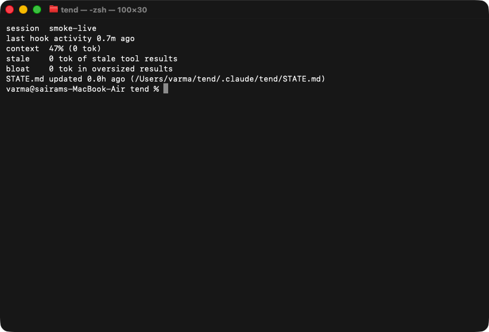
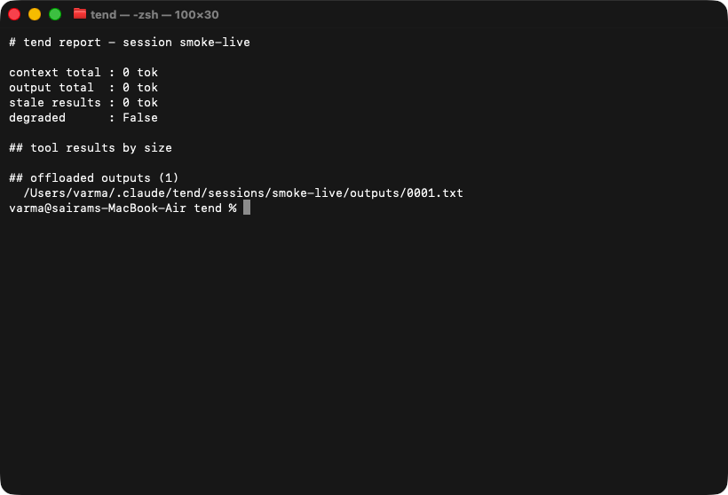
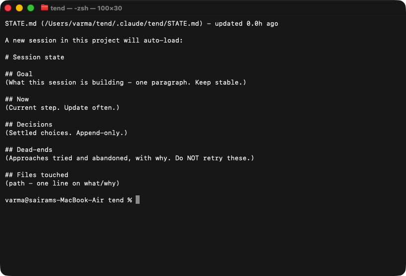
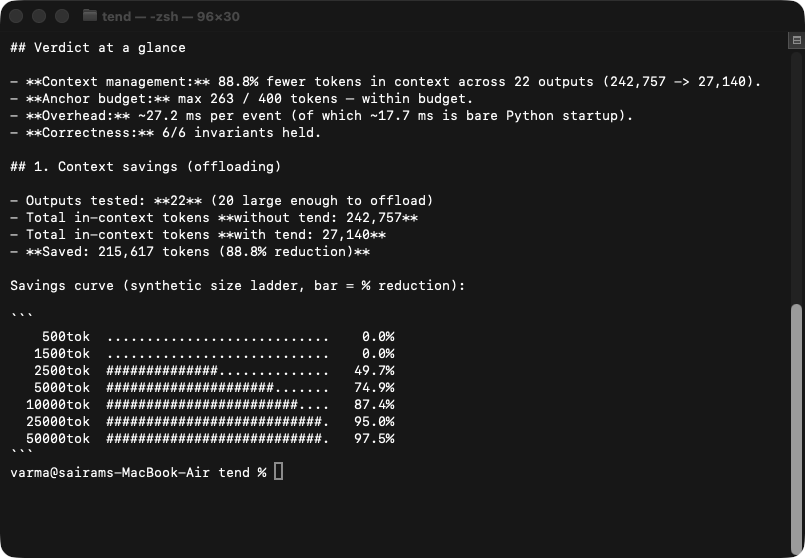
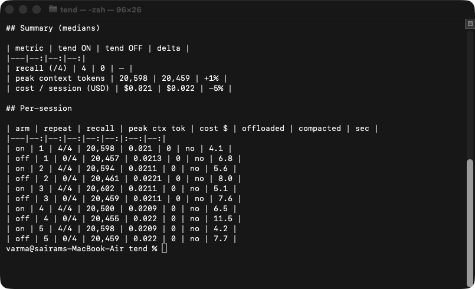
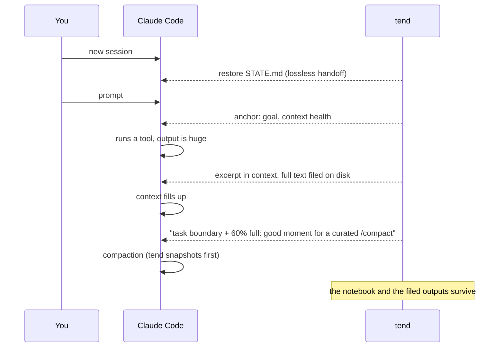

<div align="center">

# tend

**Keep Claude Code sharp in long sessions.**

[](https://github.com/varmabudharaju/tend/actions/workflows/ci.yml)
[](LICENSE)
[](pyproject.toml)

tend is a small, invisible helper that rides along with [Claude Code](https://claude.com/claude-code)
and keeps its limited *working memory* clean — so the assistant stays smart ten hours
into a big task instead of slowly losing the plot.

</div>

```
/plugin marketplace add varmabudharaju/tend
/plugin install tend@tend       # 30 seconds, fully reversible, no daemon
```

<p align="center">
  
</p>



## Results at a glance

We didn't just claim tend works — we [benchmarked it](docs/benchmark-results.md).

| What we measured | Result |
|---|---|
| In-context size of the outputs tend offloads | **86.6% smaller** — on a [frozen corpus](bench/corpus/) of real recorded outputs, reproducible by anyone |
| Recall across a context reset, given a maintained STATE.md | **4/4 with tend → 0/4 without** — every run (memory-only probe) |
| And when the model is *allowed* to go look for the file? | it finds it — at **2.1× the cost** and +2K context per probe; tend's restore is deterministic and ~free |
| tend's own per-event overhead | **~10 ms** (the handler itself is <0.3 ms) |
| Correctness invariants | **6 / 6** held — re-checked in CI on every push |
| Install footprint | daemon-less, fully reversible, fails open |

Details and the honest caveats are in [**Does it actually work?**](#does-it-actually-work) below.

## The problem, in plain words

An AI assistant has a fixed amount of working memory, called the *context window*. Think of it as a desk. Every file it reads, every command output, every conversation turn is another sheet of paper on that desk.

On long tasks the desk fills up with old papers: a 5,000-line log it needed once, three versions of a file it already fixed, dead-end experiments. Two things go wrong:

1. **The assistant gets dumber.** The important stuff (what are we building? what did we decide?) is buried under junk.
2. **Eventually the desk overflows.** The assistant has to sweep papers into a box ("compaction") — and without supervision it sometimes sweeps away the notes that mattered.

tend is the colleague who quietly keeps the desk tidy.

## What tend does — four habits

| Habit | In plain words | In Claude Code terms |
|---|---|---|
| **File it, don't pile it** | A 10-page printout gets filed in a drawer; a sticky note on the desk says which drawer. | Oversized tool outputs are replaced with a head+tail excerpt; the full text is saved to disk with its path, retrievable with a bounded `Read`. |
| **Keep a notebook** | Goals, decisions, and dead-ends live in a notebook that survives even if the desk is cleared. | Each project gets `.claude/tend/STATE.md` (Goal / Now / Decisions / Dead-ends). New sessions auto-load it, so `/clear` is a lossless handoff. |
| **Sticky note with the goal** | A note on the monitor: *what we're doing, how full the desk is*. | A ≤400-token anchor carries the goal, current step, context %, stale-result warnings, and a `/compact` recommendation when it's time. It's adaptive: an unchanged anchor isn't re-injected — only a meaningful change (or every `anchor_refresh_turns` prompts) refreshes it. |
| **Clean up at the right moment** | Tidy between tasks — never mid-thought, never throwing out the notebook. | tend detects task boundaries, recommends *curated* compaction (keep goal/decisions, drop raw outputs), snapshots before every compaction, and blocks one stale auto-compact until the notebook is updated. After a compaction it re-anchors the notebook into the fresh context, so nothing decided is lost even if Claude Code's own summary dropped it. |

And one bonus habit, added after watching real usage bills:

| Habit | In plain words | In Claude Code terms |
|---|---|---|
| **Right-sized helpers** | When the assistant hires a helper, a note suggests: this errand doesn't need the most expensive expert. | When a subagent is spawned without an explicit model, tend suggests the cheapest model tier that fits the job (see [swarm](https://github.com/varmabudharaju/swarm) for the full tiering system). |

## See it

tend speaks to the model's context, not your chat — the conversation stays clean, while the transcript view (Ctrl+O) shows every injection verbatim. What's below is the rest of its visible surface. A 15-second tour, all real tool output:

<p align="center">
  
</p>

| `tend status` | `tend report` | `tend handoff` |
|---|---|---|
|  |  |  |

## Does it actually work?

Short answer: **yes for context management, at near-zero cost** — and we measured it instead of asserting it. The harness lives in [`bench/`](bench); the full methodology and honest caveats are in [`docs/benchmark-results.md`](docs/benchmark-results.md).

### 1. It shrinks the desk — ~87% less, only where it should

<p align="center">
  
</p>

Replaying 29 tool outputs (22 **real** ones tend offloaded in production — frozen, scrubbed, and [committed in this repo](bench/corpus/) so the run reproduces for you, not just for us — plus a synthetic size ladder), big outputs collapse to a fixed ~1,250-token excerpt — full text saved to disk, retrievable on demand — while small ones are left untouched. The bigger the output, the bigger the win (54–95% per output, **86.6%** overall), and tend **never inflates** context: 6/6 invariants held, and CI re-checks them on every push. All deterministic and free to reproduce:

```bash
python3 -m bench mechanical
```

### 2. It survives a reset — 4/4 vs 0/4

<p align="center">
  
</p>

The real test of *lossless handoff*: plant four project decisions, reset the context, then ask for them back **from memory only** (no file access). With tend, a fresh session auto-restores `STATE.md` and recalls **all four — every single run**. Without tend, the model answers *"this appears to be the start of a new session"* and recalls **nothing**.

Two honest preconditions: this isolates the *restore* leg (STATE.md was maintained — tend nudges the model to keep it current, but that step is model-dependent), and the memory-only probe makes the OFF arm a floor. In the fairer control — tools **allowed**, file unnamed — vanilla Claude *did* find STATE.md in our minimal sandbox, at **2.1× the probe cost and +2K context**; tend's value there is determinism and economy, plus the resets where nothing hints the model should go looking (a crash, a silent auto-compaction). Full numbers in the [benchmark writeup](docs/benchmark-results.md).

```bash
python3 -m bench behavioral --workload handoff --repeats 5
python3 -m bench behavioral --workload discovery --repeats 5   # the fair control
```

> **Honest boundary.** When there's little to offload and no reset, tend's anchors are a small net cost: **+14%** in a Haiku stress test and **+1–31%** on Sonnet (n=2 each — ranges, not points). Each anchor is ≤400 tokens, but anchors persist in the transcript, so a session carries a standing ~1–2K of extra context that's re-read every turn. The flip side, measured in the same Sonnet run: once offloading actually fired, tend's peak context finished **below** the no-tend arm — each offload claws back more than the anchors cost. tend earns its keep on **long, multi-session, decision-heavy work**; on short tasks the code and `CLAUDE.md` already cover, it's roughly neutral.

## How it fits into a session



## Install

**As a Claude Code plugin** (recommended):

```
/plugin marketplace add varmabudharaju/tend
/plugin install tend@tend
```

That's the whole thing — hooks register automatically and the `tend` CLI lands on your PATH. Optional: `tend wrap-statusline` adds the statusline tee (exact context % in anchors + the visible heartbeat); plugins can't wrap the statusline themselves.

**Or via pip** (gets hooks + statusline in one step):

```bash
python3 -m pip install --user -e .
tend install-hook        # merges hooks + statusline into ~/.claude/settings.json
# restart your Claude Code session
```

The installer is **non-destructive and reversible**: existing hooks and statusline are preserved and backed up (`settings.json.bak-tend`), and `tend uninstall-hook` puts everything back.

**Removing it:** pip installs — `tend uninstall-hook` restores your previous
hooks and statusline exactly (they were backed up at install). Plugin installs —
`/plugin uninstall tend@tend` removes the hooks; if you ran `tend wrap-statusline`,
run `tend uninstall-hook` once to restore the original statusline (it only touches
tend-marked entries).

**How you know it's working:** your statusline grows a quiet ` | tend: 3 filed, 29k stale` suffix (just `tend: on` when there's nothing to report), and each session opens with a one-line notice — `tend: restored session state from STATE.md`. Everything else stays out of the chat view — but nothing is hidden: open the transcript view (Ctrl+O) and you'll see every `[tend anchor]` and injection exactly as the model reads it. Out of your face, fully auditable.

## Commands

| Command | Does |
|---|---|
| `tend status` | Context %, totals, stale-result tokens, STATE.md freshness |
| `tend report` | Full ledger: tool results by size, offloads, subagents |
| `tend find <regex>` | Grep across filed outputs (`--session`, `--all`, `-s`, `--max N`) |
| `tend handoff` | Show what the next session will auto-load |
| `tend clean` | Purge session state older than `retention_days` (`--days N`, `--dry-run`) |
| `tend on` / `tend off` | Global kill switch |
| `tend install-hook` / `tend uninstall-hook` | Reversible settings.json setup |

## Design principles

- **Fail-open, always.** A tend bug must never break your session. Every hook swallows its own errors (logged to `~/.claude/tend/tend.log`, rotated at 1 MB) and Claude Code continues as if tend weren't there.
- **Nudge, never block.** tend advises (read this file with a range; this spawn doesn't need the premium model; now is a good compact moment). The one narrow exception: it blocks a *stale auto-compact* exactly once, to protect the notebook.
- **Exact numbers, not guesses.** Context totals come from the session transcript's own token accounting; the context % comes from a statusline tee — tend measures, it doesn't estimate.
- **Daemon-less.** No background process. Eight tiny hook invocations that each read state from disk, act, and exit.

## Configuration

`~/.claude/tend/config.yaml`, overridable per project in `<project>/.claude/tend/config.yaml`. Keys and defaults are in `tend/config.py`. Invalid values fall back to defaults rather than disabling tend. Notable: `retention_days` (default 30) age-caps stored session state, and `anchor_refresh_turns` (default 8) re-injects an unchanged anchor at most once every N prompts (1 = every prompt).

## Privacy & disk use

- **Offloaded outputs are raw tool output** — anything a command printed
  (including a secret it echoed) is saved as plaintext under
  `~/.claude/tend/sessions/<id>/outputs/`. tend sweeps sessions older than
  `retention_days` (default 30, `0` disables) once a day at session start;
  `tend clean [--days N] [--dry-run]` purges on demand.
- **STATE.md is plain text in your repo.** Commit it if you want shared,
  reviewable handoffs across the team; add `.claude/tend/STATE.md` to
  `.gitignore` if task reasoning shouldn't enter history. tend works either way.
- Nothing ever leaves your machine: no network calls, no telemetry.

## Limitations

- **MCP tools with an `outputSchema`**: Claude Code validates replacement outputs against the tool's schema and silently keeps the original when a plain-text excerpt doesn't match. tend therefore skips offloading for `mcp__*` tools whose responses aren't plain strings. Built-in tools (Bash, Grep, Glob, WebFetch) are unaffected.
- `state_stale_tokens` counts **output tokens** generated since STATE.md was last marked (monotonic across compaction), not context-window growth. Default: 3000.

## Under the hood

No daemon, no background process: Claude Code fires an event, a tiny tend
process wakes, reads its state from disk, acts, and exits. Everything durable
lives in plain files. Full diagrams — system design, module layers, and the
advisor's whole decision tree — are in [docs/architecture.md](docs/architecture.md).

190 tests (`python3 -m pytest`). Every bug fixed in v0.2 carries a regression
test written from the bug's reproduction.

## Battle-tested by its sibling

tend v0.1 was adversarially reviewed by [swarm](https://github.com/varmabudharaju/swarm) — a 9-agent review (6 reviewers + 2 independent verifiers + synthesis) that reproduced every claim against the installed binary before reporting it. The verified report (33 confirmed findings, from a race that silently lost ledger records to a truncation bug that disabled the staleness net right after compaction) is in [`docs/swarm-review-2026-06-10.md`](docs/swarm-review-2026-06-10.md); v0.2 fixed all of them, test-first.
