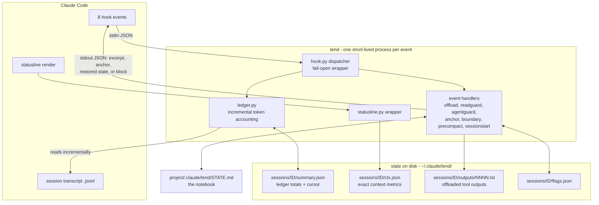
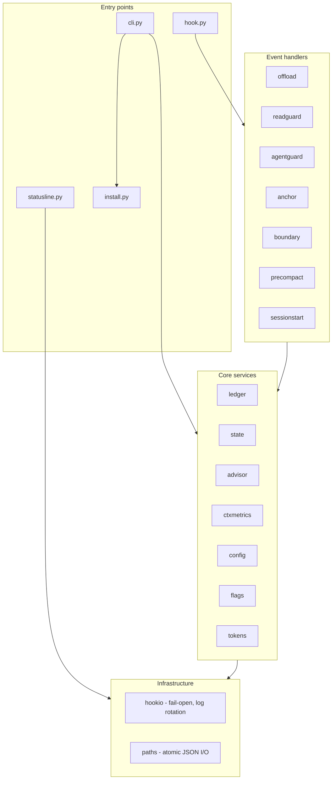
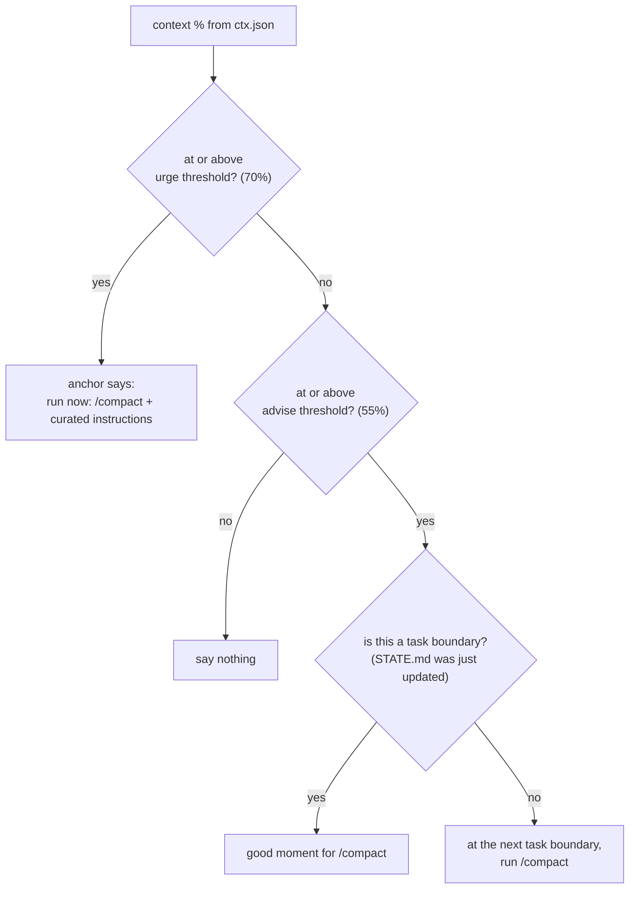
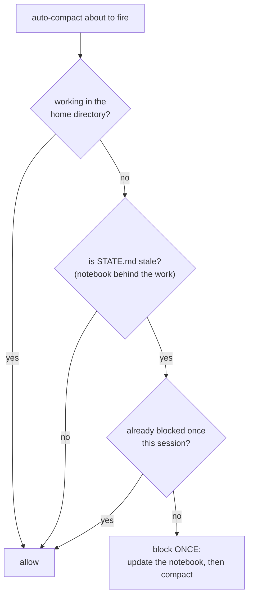

# tend architecture

How tend plugs into Claude Code: no daemon, one short-lived process per hook
event, everything durable in plain files. (Extracted from the README; this is
the deep-dive companion to [../README.md](../README.md).)

## System design — how tend plugs into Claude Code

No daemon, no background process: Claude Code fires an event, a tiny tend process wakes, reads its state from disk, acts, and exits. Everything durable lives in plain files.



## Component view — module layers



## Flow chart — when does tend recommend compaction?

The advisor runs on every prompt; this is its whole decision:



And the one time tend ever blocks anything:



## Modules

```
tend/
  hook.py          entry point: python3 -m tend.hook (all 8 events)
  hookio.py        stdin/stdout plumbing, fail-open wrapper, log rotation
  ledger.py        incremental transcript ledger: exact context totals,
                   tool-result sizes, staleness, crash-safe single-file cursor
  offload.py       pillar 1: oversized-output offloading
  readguard.py     pillar 1b: nudge unbounded Reads of large text files
  agentguard.py    pillar 1c: model-tier nudge for subagent spawns
  state.py         STATE.md template, parsing, atomic seeding
  sessionstart.py  pillar 4: state restore into fresh sessions
  anchor.py        pillar 3: per-prompt anchor (urgency-first truncation)
  boundary.py      Stop-event task-boundary + staleness detection
  precompact.py    pillar 4 safety net: snapshot + one-shot stale block
  advisor.py       when and how to recommend a curated /compact
  retention.py     age-capped GC of session state (tend clean + daily auto-sweep)
  statusline.py    statusline wrapper: tees exact context metrics to disk
  config.py        defaults < global yaml < project yaml, validated
  install.py       reversible settings.json merge (backup, mode-preserving)
  cli.py           status / report / handoff / clean / on / off / (un)install-hook
```
