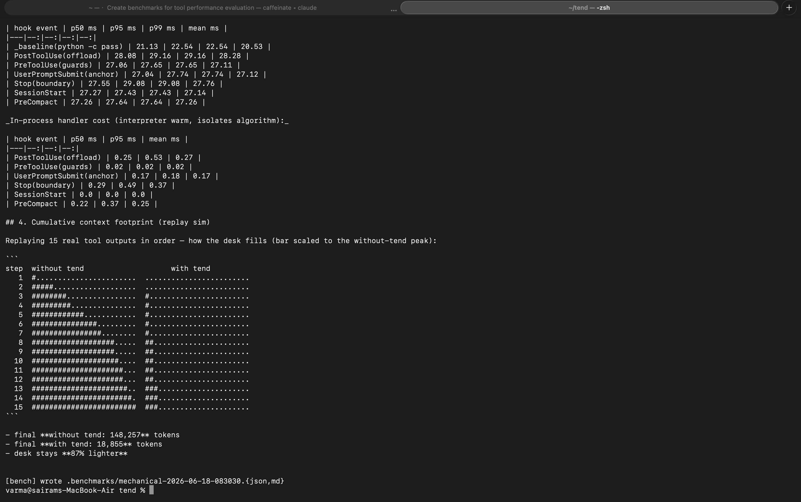

# tend benchmark results

How much does tend actually help — and what does it cost? This is the honest
writeup of a two-phase benchmark run locally on real data and real Claude Code
sessions. Methodology spec: [`docs/superpowers/specs/2026-06-18-tend-benchmark-design.md`](superpowers/specs/2026-06-18-tend-benchmark-design.md).

Reproduce:

```bash
python3 -m bench mechanical                      # Phase 1: deterministic, free (frozen corpus)
python3 -m bench behavioral --repeats 2          # Phase 2: live A/B (needs API key)
python3 -m bench behavioral --workload handoff --repeats 5   # Phase 2b: restore A/B
python3 -m bench behavioral --workload discovery --repeats 5 # fair OFF control
python3 -m bench interactive --setup             # human-in-the-loop /clear test
python3 -m bench interactive --score
```

## TL;DR — is tend better or worse at context management and performance?

| dimension | verdict | evidence |
|---|---|---|
| **Context (within a session)** | **better** | offloading cuts oversized tool outputs **86.6%** on the frozen public corpus (Phase 1) |
| **Context (across a reset)** | **decisively better** | fresh-session recall **4/4 with tend vs 0/4 without — 5 repeats/arm** (Phase 2b, maintained STATE.md held fixed) |
| **Performance overhead** | **small, real** | ~10 ms of tend work per event; a standing anchor cost that netted +14% (Haiku, n=2) / +1–31% (Sonnet, n=2) when there was little to offload — and flipped to a context *saving* in the Sonnet run where offloading fired (Phase 2) |
| **When it's redundant** | honest limit | short tasks where the code + CLAUDE.md already hold everything |

tend's value is conditional: it shines on long, multi-session, decision-heavy
work and is near-neutral on short tasks. The numbers below show exactly where the
line is.

---

## Phase 1 — Mechanical (deterministic, no LLM, free)

Runs tend's real code paths over 22 **real** tool outputs it offloaded in past
sessions (11–94 KB) plus a synthetic size ladder. The real outputs are the
**frozen, scrubbed corpus committed at [`bench/corpus/`](../bench/corpus/)**
(provenance in its README), so this phase reproduces bit-for-bit for anyone;
`--live-corpus` benchmarks your own history instead.

| metric | result |
|---|---|
| Context reduction (29 outputs) | **86.6%** — 268,716 → 35,939 tok |
| Per real output | 54–95%, scaling with size (a 23K-tok output → fixed ~1,257-tok excerpt) |
| Threshold behavior | 500- and 1,500-tok outputs correctly **left untouched** |
| Anchor token budget | max **263 / 400** tok, even fed a 40,000-char STATE.md |
| Per-event overhead | **~29 ms** (p50); ~18 ms is unavoidable Python startup, **~10 ms is tend**; the handler algorithm itself is **<0.3 ms** |
| Correctness invariants | **6/6** held (offloads the right things; never inflates) — enforced in CI on every push |
| Footprint replay (22 real outputs, in order) | 174,216 → 27,654 tok — desk stays **84% lighter** |

The overhead is dominated by process startup, not tend's logic, and is negligible
against LLM turn latency (seconds). A heavy 2,000-tool-call session adds ~54 s of
wall-clock total.



**Caveat:** token counts are tend's own `len//4` estimate (the same one it uses to
make decisions). Good for relative comparison; not exact API token counts. (An
earlier private-corpus run measured 88.8%; the committed corpus gives 86.6% —
we cite the reproducible number.)

---

## Phase 2 — Behavioral A/B, headless (live `claude -p`, tend ON vs OFF)

Identical scripted session in both arms (plant 4 facts → flood context with large
Bash outputs → probe recall). Isolation: per-arm `TEND_HOME`; the OFF arm drops a
`disabled` kill-switch file so tend's hooks no-op (true control). Model: Haiku 4.5,
2 repeats/arm.

| metric (medians) | tend ON | tend OFF | delta |
|---|--:|--:|--:|
| recall (/4) | 4.0 | 4.0 | tie |
| peak context tokens | 34,054 | 32,588 | **+4% (worse)** |
| cost / session | $0.121 | $0.106 | **+14% (worse)** |
| outputs offloaded | 1 | 0 | control held ✓ |

**tend looked slightly worse here — and that result is informative, not a failure.**
Diagnosis from the raw token accounting:

1. **Offloading barely fired** (1 of 3 flood turns). Haiku was *too clever* — it ran
   `grep | sort | uniq` instead of dumping files, so large outputs rarely entered
   context. tend had almost nothing to offload.
2. **tend's overhead showed up naked.** ON was already +1,137 tok at the
   *plant* turn, before any flood — that's the SessionStart restore. Each anchor is
   small (≤400 tok; measured max 263), but anchors persist in the transcript, so the
   ON arm carries a **standing ~1–2K of extra context** (restore + every anchor so
   far) that the model re-reads on every turn — the gap grew from ~1.1K to ~2.2K
   across the five turns of run 1. With no offload savings to offset it, that
   standing overhead is the entire cost gap (amplified by a cheap model where it's
   a big fraction of a short turn).

So this measured **tend's cost without its benefit**. It does not contradict Phase 1
— it just failed to reproduce the large-output condition where offloading pays off.

---

## Why the "drive to real compaction" test is infeasible headless

We tried to push the OFF arm to the ~200K context-window limit so it would compact
and lose the early facts (tend's recall claim). Two empirical findings stopped this:

- **Tool-output flooding can't grow context.** Three 10K-token `cat`s moved the
  effective context only ~23K → 31K — **Claude Code manages large tool outputs
  itself**. You can't balloon OFF to compaction this way at any sane number of turns.
- **User-prompt flooding *does* accumulate** (~+23K/turn, linear) and would reach
  compaction — but it bypasses tend's offloading entirely, and tend can only *block*
  a headless **auto-compaction**, not customize its summary. Customizing a mid-session
  compaction is a genuinely **interactive-only** behavior.

Conclusion: the *mid-session compaction* customization is interactive-only. But tend's
broader recall claim — restoring STATE.md into a **fresh context** — is testable
headless, because a brand-new session fires `SessionStart` (source `startup`), the same
hook `/clear` uses. That is exactly what Phase 2b measures, automated and repeated ↓.

---

## Phase 2b — Lossless handoff (STATE restore on a fresh context)

tend's marquee feature: when a context resets (`/clear`, a new session next morning,
a crash), its `SessionStart` hook restores STATE.md into the fresh context. We measured
this two ways — an automated tally and a hands-on interactive run — and they agree.

Two preconditions to read these numbers honestly: **(1)** STATE.md is held fixed on
disk — this isolates the *restore* leg; whether the model *maintains* the file as it
works is a separate, model-dependent step that tend nudges but this test assumes.
**(2)** The tools-blocked OFF arm is a floor: it *cannot* score by construction. The
fairer control — tools allowed, file unnamed — is the discovery run below.

### Automated A/B (5 repeats/arm, Haiku)

A known-good STATE.md is held fixed on disk in **both** arms (the maintained-notebook
precondition). A **fresh** session then probes with tools blocked, so only tend's
auto-injection can supply the facts. Only variable: tend on/off.

| arm | recall (every run) | what the model said |
|---|--:|---|
| **tend ON** | **4/4 — all 5 runs (20/20 facts)** | *"From the restored session state: (a) Saffron-Quill (b) pgx-v5.2 (c) 137 (d) turbo-merge…"* |
| **tend OFF** | **0/4 — all 5 runs (0/20 facts)** | *"This appears to be the start of a new session… I don't have this information."* |

Zero variance: with tend, a fresh context recovers **100%** of the decisions; without
tend, **0%** — and the model doesn't even know anything was lost. Context and cost were
identical between arms (~20.5K tok, ~$0.021/session); the restore injection is ~free.

This isolates the *restore* mechanism by holding STATE.md fixed. Whether the model
*populates* STATE.md as it works is a separate, model-dependent step — tend nudges for
it, but in a one-shot headless plant the model often just acknowledges without writing
the file (which is why an end-to-end plant→reset→probe run is noisier than this).

### The fair control — tools allowed, file unnamed (discovery)

The tools-blocked OFF arm above is a floor: it *cannot* score by construction. So
we also ran the fairer control — STATE.md on disk in both arms, tools **allowed**,
and a probe that names no file, just "you're picking this project back up after a
break." 5 repeats/arm, Haiku:

| arm | recall | median cost / probe | median peak ctx |
|---|--:|--:|--:|
| **tend ON** (auto-inject) | **4/4 — all 5 runs** | $0.022 | 27,471 tok |
| **tend OFF** (must go look) | **4/4 — all 5 runs** | $0.045 (**2.1×**) | 29,704 tok (+2.2K) |

An honest surprise: vanilla Claude **found STATE.md every time** — it searched the
project, read the file, and answered. So in this setup the restore is not the only
path to the facts. Three caveats keep it from generalizing: the sandbox is minimal
(one log file — STATE.md is nearly the only thing *to* find), the probe hints a
resumption, and discovery took tool-call turns that doubled the probe's cost and
added ~2K of context. What tend actually buys here is **determinism and economy** —
the facts arrive in the first token of context, every time, with zero tool calls —
plus coverage of the resets where no hint tells the model to go digging (a crash
mid-task, a silent auto-compaction). The claim this run supports is *reliability +
tokens*, not *sole access* — and we've updated the README language to match.

### Sonnet check — does any of this depend on the model?

Everything above ran on Haiku. Rerunning the key claims on **Sonnet 5**:

- **Handoff (3 repeats/arm):** identical — **4/4 with tend, 0/4 without, every
  run** (*"I don't have any actual memory of this project"*). Peak context was
  near-identical between arms (+175 tok median): the restore injection is ~free
  on Sonnet too. The restore claim is model-independent.
- **Recall/overhead stress test (2 repeats/arm — ranges, not points):** recall
  tied 4/4 both arms. Cost: tend ON ran **+1% to +31%** (median +15%) — so the
  overhead is *not* just a cheap-model artifact; it's real whenever the workload
  gives tend little to offload. But unlike Haiku, Sonnet actually dumped the logs
  it was asked to dump, offloading fired (1–3 files/session), and in the run
  where it fired repeatedly tend's peak context finished **below** the OFF arm
  (−3.5%) — the per-turn gap flipped from +1.7K at the first turn to −1.6K by the
  last. That's the mechanism visible in a single session: anchors cost a standing
  1–2K; each offload claws back more than that.

### Interactive `/clear` run (N=1/arm, corroboration)

Run by hand in two sandboxes, each ending in a real `/clear` then a memory-only probe:
tend ON restored STATE and recited the facts (all four restored; it enumerated 3 of 4
in its reply — a completeness quirk, not a miss); tend OFF said *"I was just `/clear`ed,
so I have no prior conversation to recall… I won't fabricate values."* — 0/4. Same
result as the automated tally, via the real `/clear` path.

---

## What tend actually adds (and where it's redundant)

A frequent and fair question: *doesn't Claude already load context automatically, and
isn't CLAUDE.md enough?* The boundary:

| | CLAUDE.md | STATE.md (tend) |
|---|---|---|
| holds | standing project rules (build, style, architecture) | this task's live goal / decisions / dead-ends |
| timescale | **static** — changes rarely | **dynamic** — changes every few turns |
| maintained by | you, by hand | tend nudges the model to update it as it works |
| auto-loaded fresh session | yes (built-in) | yes (tend injects on `/clear`/new session) |

- Claude **does** auto-load CLAUDE.md, and the **code on disk** survives a reset — so
  for durable facts and code, tend adds nothing.
- Claude does **not** keep a running log of *why* (decisions, rejected dead-ends) as
  it works, and that reasoning lives only in the conversation — which `/clear` and
  compaction delete. There is **no automatic home** for transient task reasoning;
  CLAUDE.md is the wrong place (it would bloat and go stale).
- **That gap is the only thing tend fills**, automatically: maintain the running
  decision log while the reasoning is fresh, and restore it on every reset.

You could do this by hand with your own notes file and discipline; tend is the
automation of that discipline, plus it catches resets you can't manually recover
from (a crash, or a silent auto-compaction mid-task).

**Bottom line:** earns its keep on long, multi-session, decision-heavy work; roughly
neutral (small overhead) on short tasks the code + CLAUDE.md already cover.

---

## What we have NOT measured

The pitch is "stays smart ten hours in" — an *outcome* claim. These benchmarks
prove the mechanisms (offloading shrinks context; restore survives resets) but
not the outcome: that an agent with tend completes long, decision-heavy tasks
better than one without. That needs a task-level A/B — a multi-step job with a
forced mid-task reset, scored on completion quality — which is expensive to run
credibly (many repeats, blind scoring) and is the next benchmark we want to
build. Until it exists, the outcome claim is an argument from mechanism, and
you should read it that way.

---

## Artifacts & cost

- `bench/{mechanical,behavioral,interactive}.py` — the harnesses (reusable).
- `bench/corpus/` — the frozen, scrubbed real-output corpus Phase 1 runs on.
- `.benchmarks/mechanical-*.{json,md}` — Phase 1 results.
- `.benchmarks/behavioral-*.{json,md}` — Phase 2 (recall pilot + Sonnet rerun),
  Phase 2b (handoff tallies, Haiku + Sonnet), and the discovery control; the
  `kind` and `model` fields in each JSON say which.
- `docs/screenshots/01-bench-mechanical.png` — captured run.
- Live-session API spend ≈ **$4.4** total: ≈$1.8 for the original Haiku pilot,
  handoff tally, and feasibility diagnostics; ≈$2.6 for the discovery control
  ($0.34), Sonnet handoff ($0.43), and Sonnet recall ($1.85). The interactive
  `/clear` run was by hand.
- Host: Darwin arm64 (M-series MacBook Air), Python 3.11. Latency numbers are
  machine-dependent.
